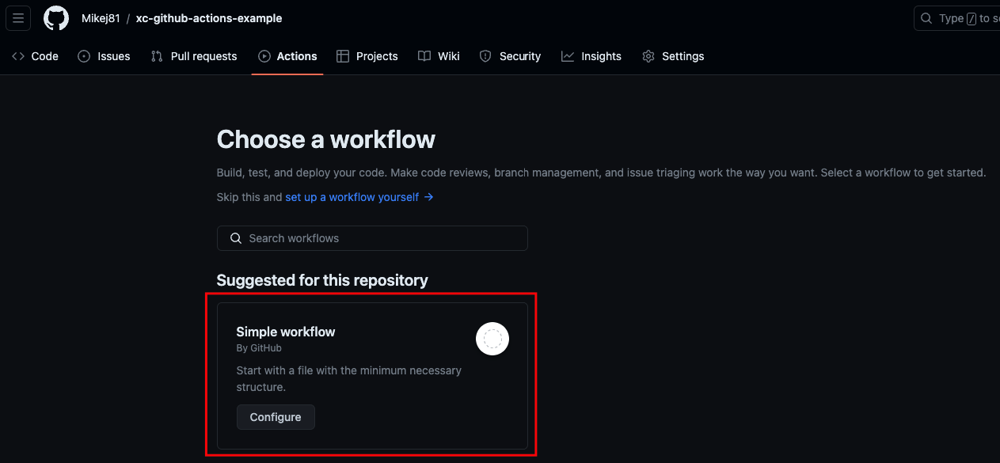
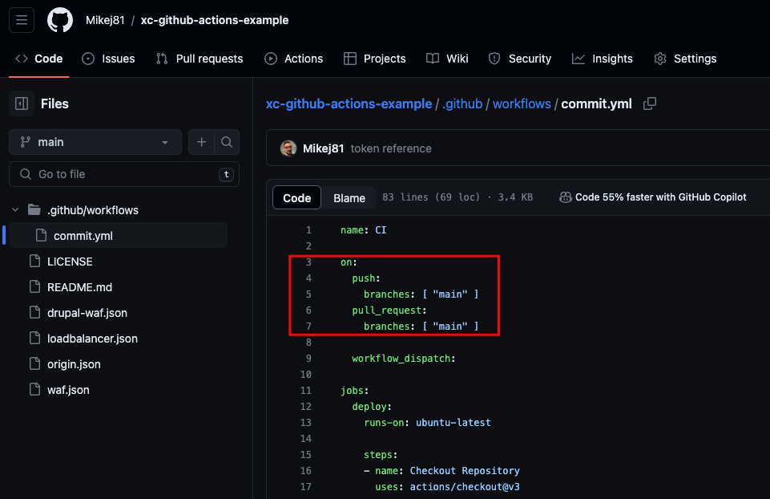
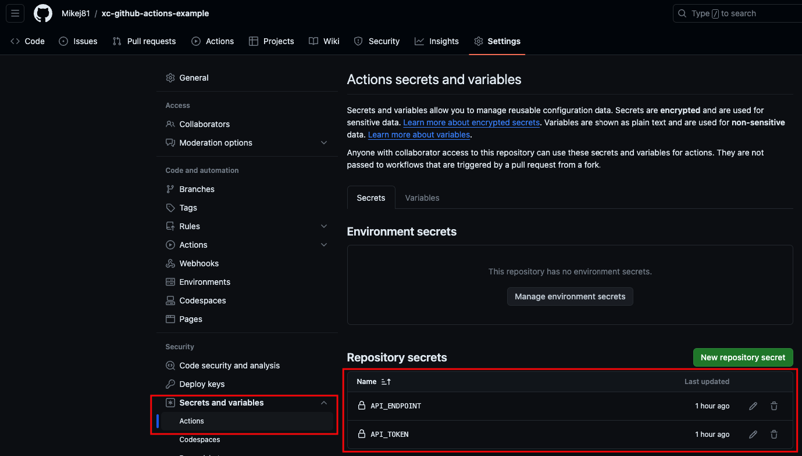

## XC Continuous Integration using Github Actions Example

This repo demonstrates how to use Github as a CI platform to maintain version control of your F5 Distributed Cloud Configurations.

## Getting Started

Setting up a CI pipeline with GitHub Actions to post JSON data to an API endpoint upon new commits involves a few steps. Here's a general approach to achieve this:

1. Create a Repository.  
You could also use an existing repository for this.

2. Create a GitHub Actions Workflow
Next, you need to create a GitHub Actions workflow in your repository. This is done by creating a .yml or .yaml file inside the .github/workflows directory of your repository. I find it easier to start in the Github Actions UI which will build a file with some predefined steps you can build off.

    

3. Define Workflow Triggers
Specify when the workflow should be triggered. In this case, we want it to run on new commits, so we can use the push event.

    

4. Define Jobs and Steps
Within the workflow, define the jobs and steps to execute. Here, we'll add steps to post JSON data to our API endpoints.

```yaml
    steps:
    - name: Checkout Repository     # Here we need to check out our code so we can do something with it.
      uses: actions/checkout@v3

    - name: Install jq              # We want to process some values from the JSON so we need to make sure jq is available.
      run: sudo apt-get install jq

    - name: Determine HTTP Method   # We want to know if we need to POST or PUT the JSON data.  POST is to create new, PUT is to update / replace.
      run: |
        LB_NAME=$(jq -r '.metadata.name' loadbalancer.json)
        echo "LB_NAME=$LB_NAME" >> $GITHUB_ENV
        NAMESPACE=$(jq -r '.metadata.namespace' loadbalancer.json)
        echo "NAMESPACE=$NAMESPACE" >> $GITHUB_ENV
  
        URL="${{ secrets.API_ENDPOINT }}/api/config/namespaces/$NAMESPACE/http_loadbalancers/$LB_NAME" # Adjust endpoint
        RESPONSE_CODE=$(curl -o /dev/null -H "Authorization: APIToken $API_TOKEN" -s -w "%{http_code}\n" -X GET "$URL")
        if [ "$RESPONSE_CODE" -eq 404 ]; then
          echo "METHOD=POST" >> $GITHUB_ENV
        else
          echo "METHOD=PUT" >> $GITHUB_ENV
        fi
      env:
        API_TOKEN: ${{ secrets.API_TOKEN }}

    - name: Post Origin JSON Data   # Here we create an Origin Pool based on the origin.json
      run: |
        ORIGIN_NAME=$(jq -r '.metadata.name' origin.json)

        if [[ $METHOD == "POST" ]]; then
          curl -X $METHOD -H "Content-Type: application/json" -H "Authorization: APIToken $API_TOKEN" -d @origin.json ${{ secrets.API_ENDPOINT }}/api/config/namespaces/$NAMESPACE/origin_pools
        else
          curl -X $METHOD -H "Content-Type: application/json" -H "Authorization: APIToken $API_TOKEN" -d @origin.json ${{ secrets.API_ENDPOINT }}/api/config/namespaces/$NAMESPACE/origin_pools/$ORIGIN_NAME
        fi
      env:
        API_TOKEN: ${{ secrets.API_TOKEN }}
```

5. Secure Your API Secret
We should secure our API keys and URL using GitHub Secrets rather than hard-coding them into the workflow file. Because thats silly and dangerous.

    - Go to your GitHub repository settings.
    - Click on "Secrets and Variables" section under Security.
    - Click on "New repository secret" and add your API key or token there.

    

6. Commit and Push Your Workflow
After setting up your workflow file, commit and push it to your repository. GitHub Actions will automatically recognize it and run the workflow according to the triggers you've set.
